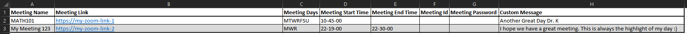

[![Contributors][contributors-shield]][contributors-url]
[![Forks][forks-shield]][forks-url]
[![Stargazers][stars-shield]][stars-url]
[![Issues][issues-shield]][issues-url]
[![Size][size-shield]][size-url]
[![Download][download-shield]][download-url]
[![LinkedIn][linkedin-shield]][linkedin-url]

<a href="https://www.paypal.com/donate?business=42UDCSWF2PHZE&currency_code=USD" target="_blank"></a>


<!-- PROJECT LOGO -->
<br />
<p align="center">
  <a href="https://github.com/APet99/ZoomWebExAutoJoiner">
    
  </a>

  <h3 align="center">Automate The Redundancy In Your Life</h3>

  <p align="center">
    An Automation tool to automatically launch, interact, and leave zoom and Webex meetings. Enter your schedule once, run the tool in the background, and never worry about missing a meeting again! 
    <br />
    <br />
    <br />
    <a href="https://youtu.be/3VX3DXcz-xQ">View Demo</a>
    ·
    <a href="https://github.com/APet99/ZoomWebExAutoJoiner/issues">Report Bug</a>
    ·
    <a href="https://github.com/APet99/ZoomWebExAutoJoiner/issues">Request Feature</a>
  </p>
</p>


<!-- TABLE OF CONTENTS -->
<details open="open">
  <summary>Table of Contents</summary>
  <ol>
    <li>
      <a href="#about-the-project">About The Project</a>
      <ul>
        <li><a href="#current-features">Current Features</a></li>
        <li><a href="#built-with">Built With</a></li>
      </ul>
    </li>
    <li>
      <a href="#getting-started">Getting Started</a>
      <ul>
        <li><a href="#prerequisites">Prerequisites</a></li>
        <li><a href="#installation">Installation</a></li>
        <li><a href="# first-time-set-up">First Time Set-up</a></li>
        <li><a href="# daily-usage">Daily Usage</a></li>
      </ul>
    </li>
    <li><a href="#roadmap">Roadmap</a></li>
    <li><a href="#contributing">Contributing</a></li>
    <li><a href="#contact">Contact</a></li>
  </ol>
</details>


<!-- ABOUT THE PROJECT -->
## About The Project

![Product Name Screen Shot][product-screenshot]
![proof2_img][proof2_img]
![log_img][log_img]

There are many automatic zoom joiners available on GitHub, however, I didn't find one that dynamically worked (or worked well). They all required prior knowledge of programming (which some people don't have).

So Why Build it?
* Not everyone knows how to read/write code
* Existing solutions did not meet my day-to-day needs
* Repetitive tasks get really old. . . really quick. Automating the boring tasks of life will free up time, energy, and prevent headaches.

While this solution met my needs, you may find that features are missing or bugs hinder use of the script. If that is the case, reach out and let's see what we can do :)
## Current Features
* Schedule is easily editable, and can be changed at any time. (Dynamic)
* Automatically join all of your zoom sessions in your schedule.
* Automatically mute mic and disable web-cam upon joining.
* Automatically log the time you joined your session as proof of attendance.
* Automatically take a screenshot upon joining as proof of attendance.
* When left running in the background, you schedule is updated daily, and will automatically join meetings set for a given day.

### Built With

This section should list any major frameworks that you built your project using. Leave any add-ons/plugins for the acknowledgements section. Here are a few examples.
* [Python 3.8.X](https://www.python.org/downloads/)


<!-- GETTING STARTED -->
## Getting Started


To get the Zoom/WebEx Automatic Joiner working; follow the steps below.

### Prerequisites
* Download and install **Python Version 3.8.X** or newer (Download [here]((https://www.python.org/downloads/)))


### Installation
1. Clone the repo
   ```sh
   git clone https://github.com/APet99/ZoomWebExAutoJoiner
   ```
3. Install pip packages

   ```sh
   pip install -r requirements.txt
   ```
   
  or
  
   ```sh
   pip install numpy
   
   pip install pandas
   
   pip install PyAutoGUI
   
   pip install opencv-python
   ```

  


### First Time Set-up
1. Complete all steps under [Getting Started](#getting-started)
   <br/>
   <br/>

2. Input your schedule into schedule.csv
   * **Required Fields:**
      * Meeting Name- The name you refer to your meeting as (ex. HIST101, Meeting with Larry, etc.).
      * Meeting Link- The meeting url.
      * Meeting Days- The days your recurring meeting is on (ex. MWR is Monday, Wednesday, Thursday of each week).
         * M = Monday
         * T = Tuesday
         * W = Wednesday
         * R = Thursday
         * F = Friday
         * S = Saturday
         * U = Sunday
      * Meeting Start Time- The time your meeting starts (uses the 24-hour format. HH-MM-SS).
   
   * **Optional Fields:**
      * Meeting End Time- The time your meeting ends (uses the 24-hour format. HH-MM-SS). **Currently not supported**
      * Meeting ID- The ID associated with a session. **Currently not supported**
      * Meeting Password- The password associated with a session. **Currently not supported**
      * Custom Message- If a message is listed, it will be sent when initially joining the session. Message is not required.
3. Save the schedule and proceed to [Daily Use](#Daily Use).
### Daily Use 
Simply run the python script by:

Going to the project directory
   ```sh
   cd /my/project/path/
   ```
Running the script
   ```sh
   python main.py
   ```

**Note: If you want the script to run in the background**
   ```sh
   python main.py &
   ```

## Roadmap
Features currently being developed includes:
* Ability to leave meetings at a selected time.
* Compatibility with WebEx sessions.
* Streamlined in-meeting actions
* Support for ID/Password sessions

Recommended future features and known bugs can be found [here](https://github.com/APet99/ZoomWebExAutoJoiner/issues).


<!-- CONTRIBUTING -->
## Contributing
Want to help? Contributions foster an amazing place to be learn, inspire, and create. Any contributions you make are **greatly appreciated**.

1. Fork the Project
2. Create your Feature Branch (`git checkout -b feature/AmazingFeature`)
3. Commit your Changes (`git commit -m 'Add some AmazingFeature'`)
4. Push to the Branch (`git push origin feature/AmazingFeature`)
5. Open a Pull Request


<!-- CONTACT -->
## Contact

Alex Peterson - Discord: You12boo_#6682 
Project Link: [https://github.com/APet99/ZoomWebExAutoJoiner](https://github.com/APet99/ZoomWebExAutoJoiner)


[contributors-shield]: https://img.shields.io/github/contributors/APet99/ZoomWebExAutoJoiner?style=plastic&logo=appveyor
[contributors-url]: https://github.com/APet99/ZoomWebExAutoJoiner/graphs/contributors

[forks-shield]: https://img.shields.io/github/forks/APet99/ZoomWebExAutoJoiner?style=plastic&logo=appveyor
[forks-url]: https://github.com/APet99/ZoomWebExAutoJoiner/network/members

[stars-shield]: https://img.shields.io/github/stars/APet99/ZoomWebExAutoJoiner?style=plastic&logo=appveyor
[stars-url]: https://github.com/APet99/ZoomWebExAutoJoiner/stargazers

[issues-shield]: https://img.shields.io/github/issues/APet99/ZoomWebExAutoJoiner?style=plastic&logo=appveyor
[issues-url]: https://github.com/APet99/ZoomWebExAutoJoiner/issues

[size-shield]: https://img.shields.io/github/repo-size/APet99/ZoomWebExAutoJoiner?style=plastic&logo=appveyor
[size-url]: https://github.com/APet99/ZoomWebExAutoJoiner/releases/tag/1.0.0

[issues-url]: https://github.com/APet99/ZoomWebExAutoJoiner/archive/master.zip


[linkedin-shield]: https://img.shields.io/badge/-LinkedIn-black?style=plastic&logo=appveyor
[linkedin-url]: https://www.linkedin.com/in/alexpeterson99/


[download-shield]: https://img.shields.io/github/downloads/APet99/ZoomWebExAutoJoiner/total?style=plastic&logo=appveyor
[download-url]: https://github.com/APet99/ZoomWebExAutoJoiner/releases/tag/1.0.0
[product-screenshot]: images/misc/app_proof.png
[proof2_img]: images/misc/proof2.png
[log_img]: images/misc/log.png
